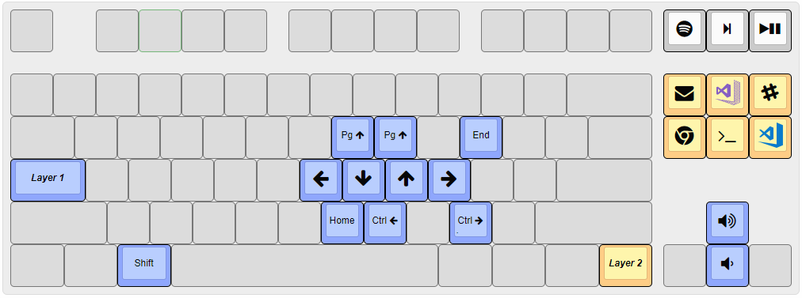

# AutoHotkey

> My personal Autohotkey productivity suite including shortcuts, hotstrings, hotkeys, apps/utilities, AutoCorrect

You can easily set up your own using [my AutoHotkey-Boilerplate project](https://github.com/denolfe/AutoHotkey-Boilerplate).

## Contents

* [App Launch Hotkeys](Core/Shortcuts.ahk)
* [App-specific Hotkeys](AppSpecific)
* [Text Expansion Hotstrings](Core/Hotstrings.ahk)
* [Movement keys](Shortcuts/CapsNav.ahk) with <kbd>CapsLock</kbd> + <kbd>h</kbd>, <kbd>j</kbd>, <kbd>k</kbd>, <kbd>l</kbd> and more
* [AutoCorrect](Core/AutoCorrect.ahk) with personal additions.
* [VolumeScroll](https://github.com/denolfe/VolumeScroll) helper
* [WindowPadX](https://github.com/hoppfrosch/WindowPadX) with [custom config](WindowPadX.Custom.ini)
* [Useful AutoHotkey Utilities](Utilities)

### Keyboard Layout: CapsNav and Shortcuts

## How to Use

* Install AutoHotkey_L [here](http://l.autohotkey.net/)
* `git clone https://github.com/denolfe/AutoHotkey.git --recursive`
* Run `Work.ahk`
